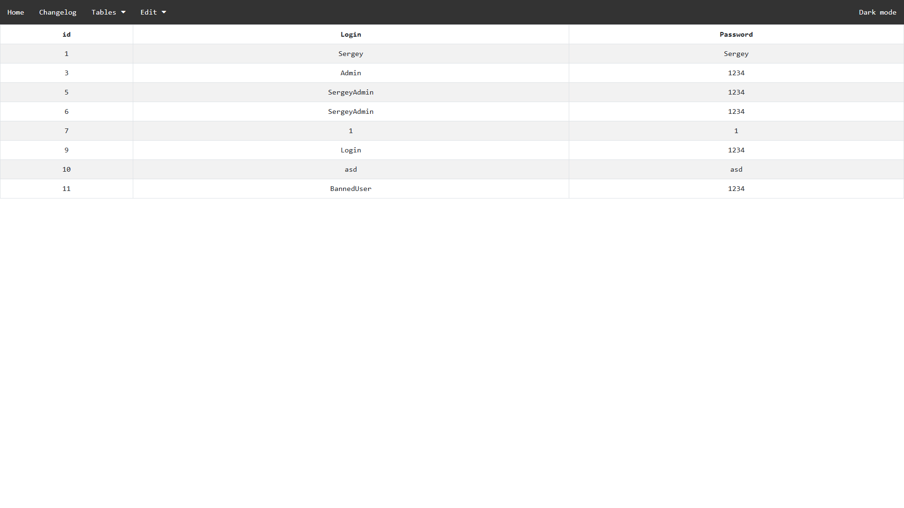
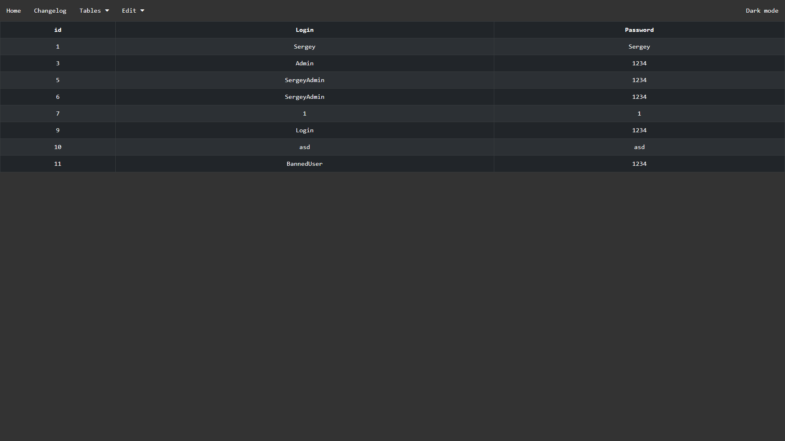
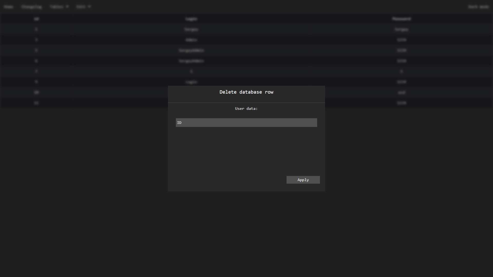
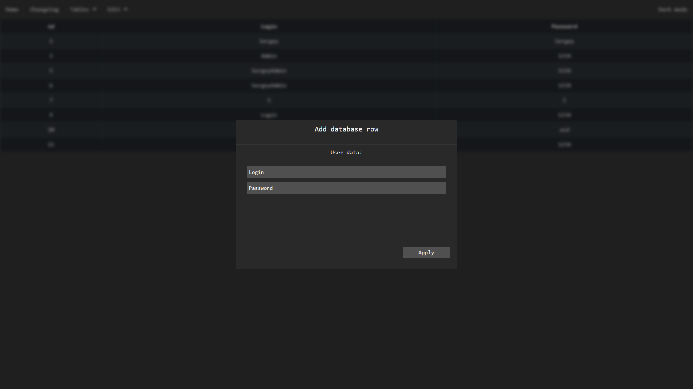
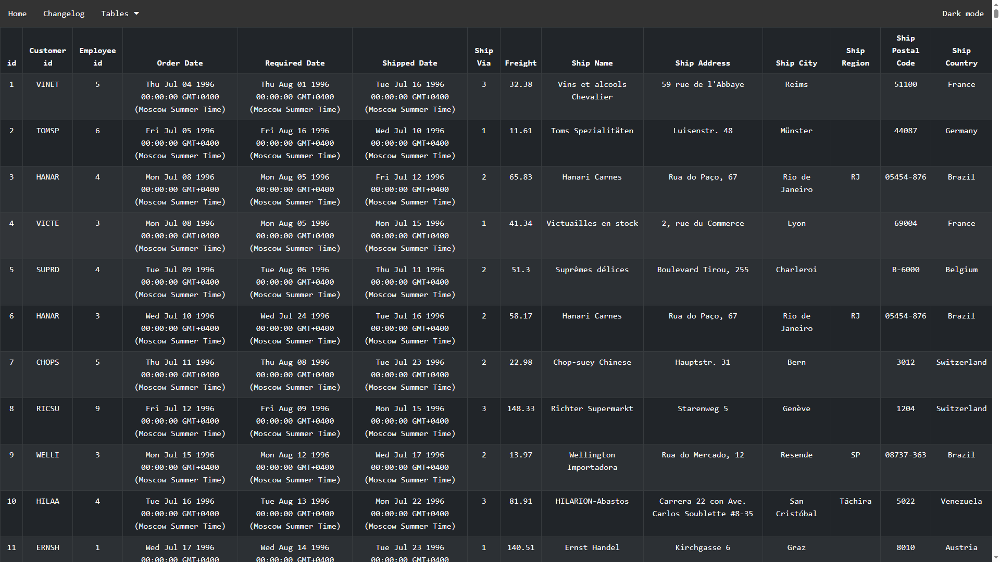

<h4 style="text-align:center;">Web site based on NodeJS for viewing NorthWindDataBase</h4>

<p style="text-align:center;font-size:20px;font-weight:bold;">Already done:</p>
<li>Login window ( Default: Admin; 1234 )</li>
<li>View main tables like: Users, Categories etc</li>
<li>Edit table row info ( not for each table )</li>
<li>Add table row ( not for each table )</li>
<li>Theme switcher ( from light to dark and back )</li>
<li>Theme switcher ( from light to dark and back )</li>

<p style="text-align:center;font-size:20px;font-weight:bold;">Some ScreenShots:</p>






<p style="text-align:center;font-size:20px;font-weight:bold;">How to install and run:</p>
<li>Donwload source code</li>
<li>Install nodejs</li>
<li>Check needToInstall.txt file and install all packages</li>
<li>Download pgAdmin and postgresql sdk</li>
<li>Create database in pgadmin</li>
<li>Import sql file ( The one you downloaded with the source code ) in pgadmin</li>
<li>Open source code folder in IDE ( on you choose )</li>
<li>Write in console:</li>
```
node server.js
```
<li>All done</li>